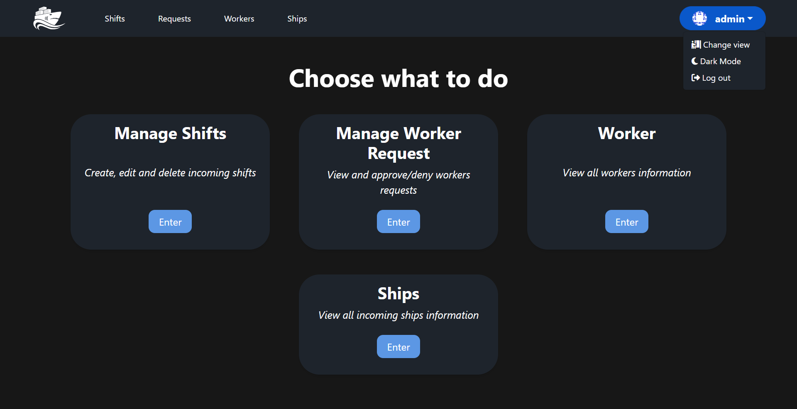
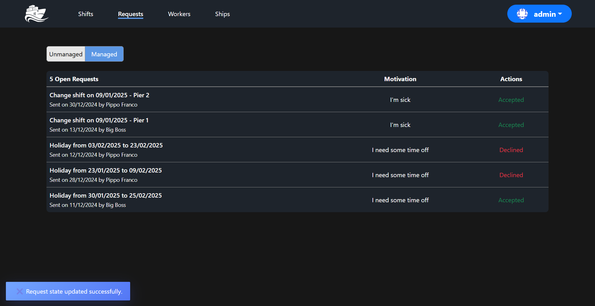
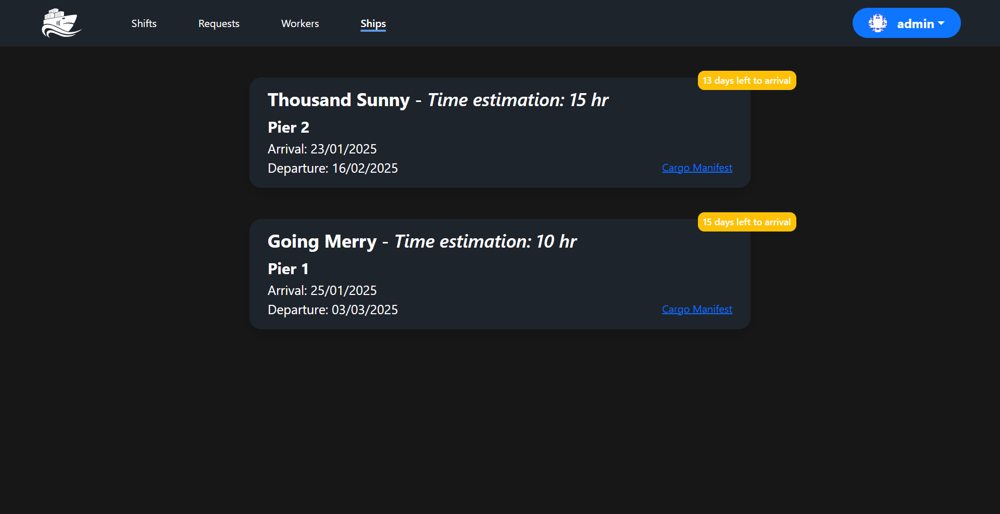
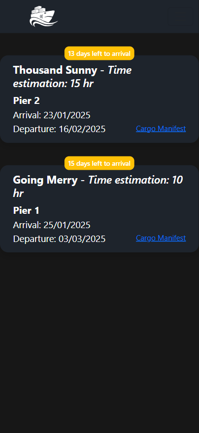

    

## What is Mako...
Mako is a *free* and *open source* web app in **.NET**, and other technologies, for managing workers, ships, and shifts in a naval port.

## What Mako has to offer...
These are all the features:
- Login for Operators and Workers.
- View for workers with the ability to see their shifts and request holidays, permits, etc.
- View for operators with the possibility of checking incoming boats (with all the necessary information), creating/managing the various shifts of unloading and loading goods, and more.
- Light and Dark Mode.

## Start-up
- Open project with *Visual Studio 2022*
- Install packages by opening the context menu by right-clicking on *package.json* in *Mako.Web*
- Update bundles using the *Bundle & Minifier 2022* extension by right-clicking on *Mako.Web*
- Re-compile all files using *Web Compiler 2022* by right-clicking on *Mako.Web*
- Right-click on *Mako.Web* and select the option *Set as startup project*

## Project's Mockup
Check out Mako's Mockups in Figma:
- [Operator view](https://www.figma.com/design/wp4ofGMWtQCbbOWIsLGGwD/Operatore-Mockup?node-id=0-1&t=vPq89MnYvnbvDabX-1)
- [Worker view](https://www.figma.com/design/SJbFipIt2abZ3dJBM9sFSn/Operai-Mockup?node-id=0-1&t=R42TsY5lXLRRKSUv-1)

## Project's DB
Check out Mako's database diagram

    

[Or check out dbdiagram.io](https://dbdiagram.io/d/Mako-DB-676a7daf5406798ef78a3dde)

## Project's Screenshots

    
    
    

    
    

